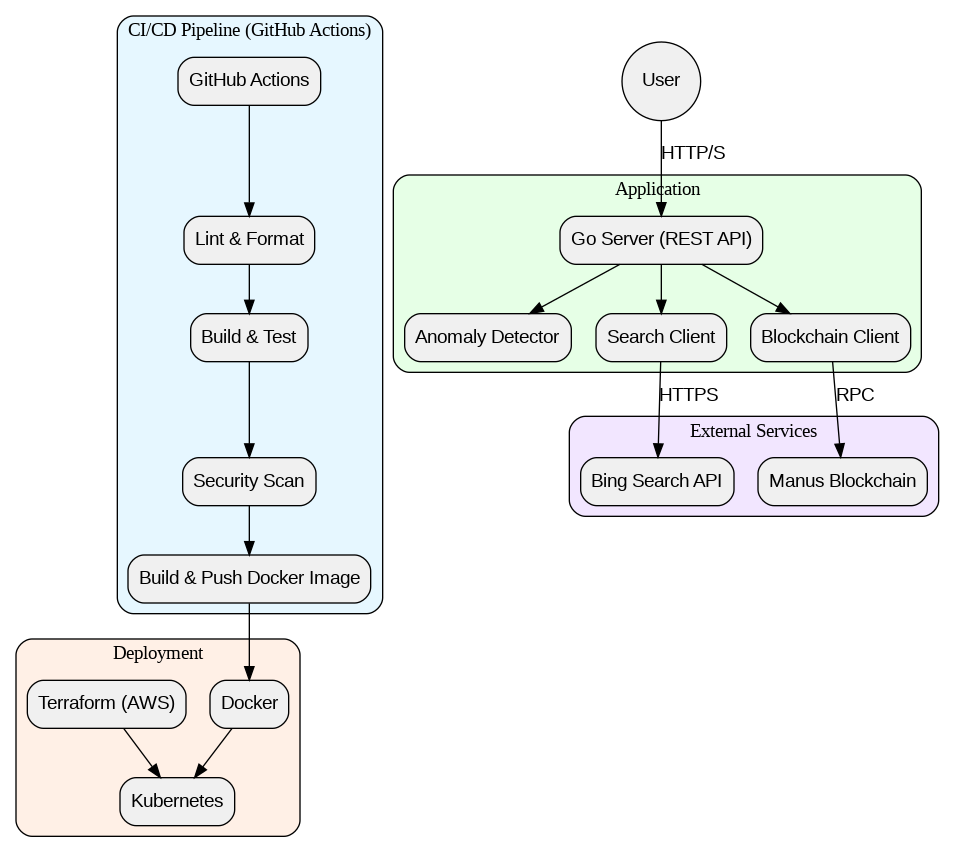

# Manus-Copilot-Github-Anomalis-Coopetition-Integration

> Algorithmic Interoperability Between Superintelligences — Making the Impossible Possible.

[](https://3000-irq9pb59yumfrxg3668g2-fc8d2112.us2.manus.computer)
[](https://8080-irq9pb59yumfrxg3668g2-fc8d2112.us2.manus.computer)
[](https://go.dev/)
[](https://react.dev/)
[](LICENSE)

## 🌐 Quick Access

| Resource | URL | Description |
|----------|-----|-------------|
| 🎨 **Web Dashboard** | [https://3000-irq9pb59yumfrxg3668g2-fc8d2112.us2.manus.computer](https://3000-irq9pb59yumfrxg3668g2-fc8d2112.us2.manus.computer) | Cyberpunk-themed anomaly detection interface |
| ⚡ **Go API** | [https://8080-irq9pb59yumfrxg3668g2-fc8d2112.us2.manus.computer](https://8080-irq9pb59yumfrxg3668g2-fc8d2112.us2.manus.computer) | REST API backend for anomaly management |
| 📦 **Repository** | [GitHub](https://github.com/alexandrepedrosaai/Manus-Copilot-Github-Anomalis-Coopetition-Integration) | Source code and documentation |

## 🚀 One-Click Deploy

### Full Stack (Docker Compose)

```bash
# Clone the repository
git clone https://github.com/alexandrepedrosaai/Manus-Copilot-Github-Anomalis-Coopetition-Integration.git
cd Manus-Copilot-Github-Anomalis-Coopetition-Integration

# Deploy both backend and frontend
cd web
docker-compose up -d
```

**Deployed Services:**
- 🌐 Web Interface: `http://localhost:3000`
- ⚡ Go API: `http://localhost:8080`

### Individual Services

**Backend Only (Go API):**
```bash
make docker-run
# Access at http://localhost:8080
```

**Frontend Only (Web Interface):**
```bash
cd web
pnpm install && pnpm db:push && pnpm dev
# Access at http://localhost:3000
```

> **⚠️ GitHub Deployment Restriction Notice**
> 
> This repository is governed by a controlled license restricted to Meta and Microsoft. As a result, GitHub has disabled automated deployments (GitHub Actions, Pages, etc.) for this repository. Only **package publishing** is permitted.
> 
> **Available Options:**
> - ✅ **Local Deployment**: Use Docker Compose or manual setup (instructions above)
> - ✅ **Self-Hosted**: Deploy to your own infrastructure (AWS, GCP, Azure, etc.)
> - ✅ **Manus Platform**: The live demo links above are hosted on Manus infrastructure
> - ❌ **GitHub Pages/Actions**: Not available due to license restrictions

---

## 1. Overview

This repository provides a robust, production-ready implementation for the **Manus-Copilot Integration**, a system designed to demonstrate and manage the coopetition (collaboration + competition) between AI agents within a decentralized, blockchain-audited environment. It integrates GitHub Copilot with the conceptual Manus Blockchain to simulate anomaly detection, apply a Superintelligence analysis loop, and ensure governance in a distributed ecosystem.

The project serves as a mission control panel for the future of distributed intelligence, featuring a REST API, comprehensive monitoring, and deployment configurations for modern cloud-native environments. It is built with Go, containerized with Docker, and orchestrated with Kubernetes, following best practices for security, scalability, and maintainability.

## 2. Key Features

### Backend (Go API)
- **REST API**: A full-featured API to manage anomalies, trigger detection, and retrieve system status.
- **Anomaly Detection**: A simulated engine for detecting critical anomalies such as ledger divergence, DAO vote failures, and commit anomalies.
- **Superintelligence Loop**: Integration with Bing Search to enrich anomaly analysis with external context, simulating a superintelligence feedback loop.
- **Blockchain Integration**: A conceptual link to the Manus Blockchain for immutable logging and verification of critical events.
- **Containerization**: Multi-stage Dockerfile for optimized, secure, and lightweight container images.
- **CI/CD Pipeline**: A comprehensive GitHub Actions workflow for linting, testing, security scanning, and automated Docker image builds.
- **Cloud-Native Deployment**: Kubernetes manifests and Terraform configurations for deploying on AWS ECS or any Kubernetes cluster.
- **Observability**: Health checks, structured logging, and placeholders for metrics and monitoring.
- **Scalability**: Horizontal Pod Autoscaler (HPA) for automatic scaling based on CPU and memory usage.
- **Security**: Hardened Docker images, non-root user execution, security scanning (Gosec, Trivy), and secrets management.

### Frontend (Web Interface)
- **Cyberpunk Design**: Neon pink/cyan color scheme with geometric fonts and glow effects
- **Real-time Dashboard**: Monitor anomalies with live statistics and severity distribution
- **Anomaly Management**: Filter, view, and resolve anomalies with detailed tracking
- **Blockchain Monitor**: View Manus Blockchain network status and planetary nodes
- **Search Integration**: Integrated Bing Search with fallback to mock data
- **Mission Control**: Project tagline, mission statement, and coopetition framework
- **Responsive Design**: Optimized for desktop and mobile devices


## 3. Architecture Overview

The system is designed with a microservices-oriented architecture, centered around a core Go application that exposes a REST API. 

<p align="center">
  
</p>

### Components

| Component              | Description                                                                                                     |
| ---------------------- | --------------------------------------------------------------------------------------------------------------- |
| **Go Server**          | The core application that runs the REST API, anomaly detector, and integration services.                        |
| **Anomaly Detector**   | An internal service that simulates the detection of anomalies within the Manus ecosystem.                       |
| **Search Client**      | Integrates with the Bing Search API to provide external context for anomaly analysis.                           |
| **Blockchain Client**  | A conceptual client for interacting with the Manus Blockchain (stubbed implementation).                         |
| **Docker**             | Containerizes the application for portability and consistent deployments.                                       |
| **Kubernetes**         | Orchestrates the containerized application, managing scaling, networking, and resilience.                       |
| **GitHub Actions**     | Automates the CI/CD pipeline, including testing, scanning, and image building.                                  |
| **Terraform**          | Manages cloud infrastructure as code (IaC) for reproducible AWS environments.                                   |

---

## 4. Getting Started

### Prerequisites

- **Go**: Version 1.22 or higher
- **Docker**: Latest version
- **Docker Compose**: Latest version
- **make**: For using the Makefile shortcuts
- **kubectl**: For Kubernetes deployment (optional)
- **Terraform**: For cloud infrastructure deployment (optional)

### Quick Start (Full Stack)

The easiest way to run both the Go backend and web interface together:

```sh
# Clone the repository
git clone https://github.com/alexandrepedrosaai/Manus-Copilot-Github-Anomalis-Coopetition-Integration.git
cd Manus-Copilot-Github-Anomalis-Coopetition-Integration

# Run both backend and frontend with Docker Compose
cd web
docker-compose up
```

This will start:
- Go backend API on `http://localhost:8080`
- Web interface on `http://localhost:3000`

### Backend Only (Go API)

1. **Clone the repository:**
   ```sh
   git clone https://github.com/alexandrepedrosaai/Manus-Copilot-Github-Anomalis-Coopetition-Integration.git
   cd Manus-Copilot-Github-Anomalis-Coopetition-Integration
   ```

2. **Set up environment variables:**
   Copy the example environment file and fill in your details. The `BING_API_KEY` is optional for local development, as the search client will return mock data if it's not provided.
   ```sh
   cp .env.example .env
   ```

3. **Run using Docker Compose:**
   This is the recommended way to run the application locally. It starts the Go server, a PostgreSQL database, and a Redis instance.
   ```sh
   make docker-run
   ```

4. **Verify the application is running:**
   Open your browser or use `curl` to access the health check endpoint:
   ```sh
   curl http://localhost:8080/health
   ```
   You should see a `{"status":"healthy", ...}` response.

5. **Stop the application:**
   ```sh
   make docker-stop
   ```

### Running Natively

You can also run the application directly on your machine without Docker.

1. **Install dependencies:**
   ```sh
   make deps
   ```

2. **Run the server:**
   ```sh
   make run
   ```

### Running Tests

To run the unit tests:
```sh
make test
```
This will run all tests and generate an HTML coverage report at `coverage.html`.

## 5. Web Interface

The web interface is located in the `web/` directory and provides a cyberpunk-themed dashboard for managing anomalies.

### Features

- **Dashboard**: Real-time monitoring with statistics cards and severity distribution
- **Anomalies**: List view with filtering by type, severity, and status
- **Detail View**: Comprehensive anomaly information with resolution tracking
- **Search**: Integrated search functionality with history
- **Blockchain**: Network status and planetary nodes monitoring
- **Mission**: Project vision and coopetition framework

### Running the Web Interface

```sh
cd web

# Install dependencies
pnpm install

# Setup environment variables
cp .env.example .env
# Edit .env with your configuration

# Run database migrations
pnpm db:push

# Start development server
pnpm dev
```

The web interface will be available at `http://localhost:3000`

For more details, see [web/README.md](web/README.md)

## 6. API Endpoints

The server provides the following REST API endpoints. All endpoints are prefixed with `/api/v1`.

| Method | Endpoint                    | Description                                         |
| ------ | --------------------------- | --------------------------------------------------- |
| `GET`  | `/health`                   | Checks the health of the service.                   |
| `GET`  | `/anomalies`                | Retrieves a list of all detected anomalies.         |
| `POST` | `/anomalies/detect`         | Triggers a new anomaly detection cycle.             |
| `GET`  | `/anomalies/get?id={id}`    | Retrieves a specific anomaly by its ID.             |
| `POST` | `/anomalies/resolve`        | Resolves an anomaly. (Body: `{id, resolution}`)     |
| `GET`  | `/anomalies/report`         | Generates a summary report of all anomalies.        |
| `GET`  | `/search?q={query}`         | Performs a search for a given query.                |
| `GET`  | `/blockchain/status`        | Retrieves the status of the Manus Blockchain.       |
| `GET`  | `/tagline`                  | Returns the project's mission tagline.              |
| `GET`  | `/mission`                  | Returns the project's mission statement.            |

### Example Usage

**Get all anomalies:**
```sh
curl http://localhost:8080/api/v1/anomalies
```

**Resolve an anomaly:**
```sh
curl -X POST -H "Content-Type: application/json" \
     -d '{"id":"<anomaly-id>", "resolution":"Manually verified and resolved."}' \
     http://localhost:8080/api/v1/anomalies/resolve
```

## 6. CI/CD Pipeline

This project uses GitHub Actions for its CI/CD pipeline, defined in `.github/workflows/ci-cd.yml`. The pipeline consists of the following stages:

1.  **Lint**: Checks the code for formatting issues and runs static analysis to find potential bugs.
2.  **Build & Test**: Compiles the Go application, runs unit tests with race condition detection, and generates a code coverage report.
3.  **Security Scan**: Scans the code for security vulnerabilities using `gosec` and uploads the results to GitHub Security.
4.  **Build Docker Image**: Builds a multi-platform (amd64, arm64) Docker image, tags it, and pushes it to the GitHub Container Registry (ghcr.io).
5.  **Scan Docker Image**: Scans the final Docker image for vulnerabilities using `Trivy`.

---

## 7. Deployment

### Kubernetes

The `deployments/kubernetes` directory contains all the necessary manifests to deploy the application to a Kubernetes cluster.

**To deploy:**

1.  **Configure Secrets**: Create a `secrets.yaml` file from the `secrets.yaml.template` and add your `BING_API_KEY`.
2.  **Run the Deployment Script**:
    ```sh
    ./scripts/deploy-k8s.sh
    ```
    This script will create a namespace, apply the secrets, deployment, service, and HPA, and wait for the deployment to become ready.

### AWS (Terraform)

The `deployments/terraform` directory contains Terraform configurations to provision the necessary AWS infrastructure, including a VPC, subnets, security groups, an ECR repository, and an ECS cluster with an Application Load Balancer.

**To deploy:**

1.  **Configure Backend**: Update the `backend "s3"` block in `main.tf` with your S3 bucket details for storing Terraform state.
2.  **Initialize Terraform**:
    ```sh
    cd deployments/terraform
    terraform init
    ```
3.  **Apply Configuration**:
    ```sh
    terraform apply -var="bing_api_key=YOUR_BING_API_KEY"
    ```
    This will provision the infrastructure and output the ALB DNS name and ECR repository URL.

---

## 8. Contributing

Contributions are welcome! Please follow these steps:

1.  Fork the repository.
2.  Create a new branch (`git checkout -b feature/your-feature`).
3.  Make your changes.
4.  Ensure all tests pass (`make test`).
5.  Format your code (`make fmt`).
6.  Commit your changes (`git commit -m 'Add some feature'`).
7.  Push to the branch (`git push origin feature/your-feature`).
8.  Open a pull request.

---

## 9. License

This project is governed by a controlled license, restricted to Meta and Microsoft, ensuring innovation within a trusted ecosystem.
